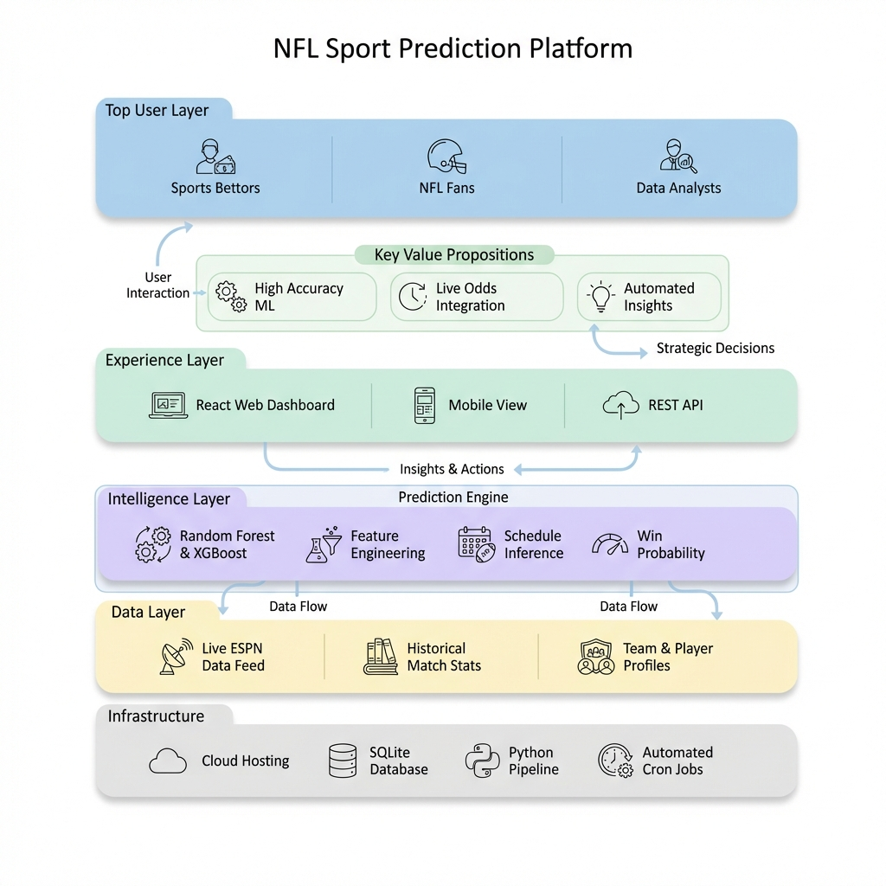

# 🏈 BetMatrix: NFL Match Outcome Predictor

BetMatrix is a high-performance, machine learning-driven analytics platform designed to predict NFL game outcomes with enterprise-grade accuracy. It leverages advanced gradient boosting (CatBoost) and a modern microservices architecture to provide real-time insights and predictive modeling.



## 🌟 Key Features

- **ML Pipeline**: Powered by CatBoost for robust, feature-rich classification and regression.
- **Dynamic Feature Engineering**: Automated processing of NFL historical data, player stats, and environmental factors.
- **Real-time API**: High-concurrency backend built with FastAPI and Pydantic.
- **Modern Dashboard**: A slick, responsive frontend using Vite, React, and Shadcn UI.
- **Dockerized Workflow**: Seamless local development and production deployment via Docker Compose.

## 🛠️ Technology Stack

### Backend
- **Core**: Python 3.12, FastAPI
- **ML Engine**: CatBoost, Scikit-learn, Pandas
- **AI Agentic Layer**: LangChain
- **Validation**: Pydantic v2

### Frontend
- **Framework**: React 18, Vite
- **Language**: TypeScript
- **Styling**: Tailwind CSS, Lucide Icons
- **Components**: Radix UI, Shadcn UI

## 🚀 Getting Started

### Prerequisites
- Docker & Docker Compose
- Python 3.12+ (for local development)

### One-Click Setup
The entire stack is containerized for easy deployment:

```bash
docker-compose up --build
```

Access the services at:
- **Frontend**: http://localhost:5173
- **Backend API**: http://localhost:8000/docs (Swagger UI)

## 📁 Project Structure

```text
BetMatrix/
├── backend/            # Python FastAPI + ML Pipeline
│   ├── app/            # Main logic & Routers
│   ├── models/         # Trained Model Artifacts (.pkl)
│   └── data/           # Historical Data & Processed CSVs
├── frontend/           # Vite + React + Tailwind
│   ├── src/            # Components, Hooks, & State
│   └── public/         # Static assets
└── docs/               # Architecture and technical specifications
```

## 📊 ML Model Details
The prediction engine utilizes a multi-staged pipeline:
1. **Pre-processing**: Cleaning raw NFL data and handling missing values.
2. **Feature Engineering**: Creating rolling averages, team rankings, and home-field advantage metrics.
3. **Training**: Gradient Boosting on Decision Trees (CatBoost) with optimized hyper-parameters.
4. **Evaluation**: Glicko-2 based ranking adjustments and log-loss scoring.

---
*Created with focus on high-fidelity performance and AI-driven insights.*
